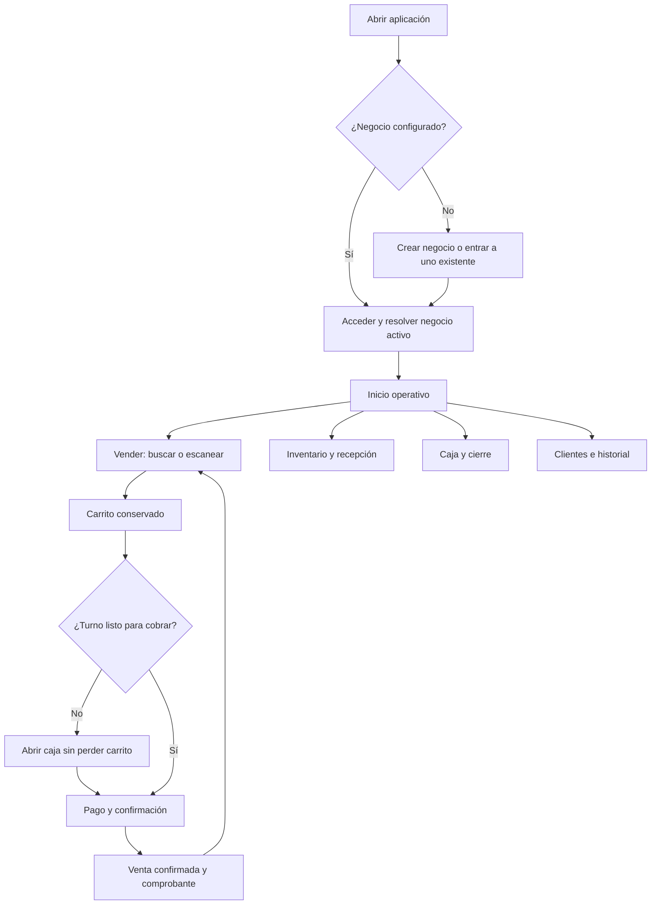

# MultiPOS: revisión de producto, UI/UX y plan de acción

Fecha: 5 de septiembre de 2026 (America/La_Paz). Base: checkout de `D:/multi-pos-1`, con cambios locales, sobre commit `838277b37fc3415e1e8b858bcfb7c18a00be8630`.

## 1. Dictamen

MultiPOS tiene una base aprovechable: diez pantallas principales, componentes compartidos, registro de negocios, catálogo, carrito, cobro, caja, créditos, historial y lotes. No recomiendo reescribirlo. Recomiendo completar primero un recorrido operativo coherente y, sobre él, consolidar un sistema visual.

La principal debilidad de UI/UX no es simplemente el color: la interfaz mezcla controles operativos con elementos demostrativos; algunas acciones no responden y algunos datos solicitados no llegan a persistirse. Para un cajero, un diseño excelente significa encontrar el producto correcto, cobrar sin ambigüedad y continuar trabajando sin perder el contexto.

El producto es **multirrubro parcialmente especializado**. Ofrece Tienda, Ferretería, Autopartes, Motopartes y Farmacia. Farmacia tiene comportamiento propio; los demás rubros comparten principalmente catálogo y venta genérica. La experiencia de **gestionar varias empresas o sucursales desde una cuenta** todavía no está resuelta en las pantallas revisadas. Son dos capacidades distintas que deben diseñarse por separado.

Prioridad recomendada: **cobro y datos coherentes → navegación y sistema visual → inventario → especialización por rubro → reportes y herramientas de administración**.

## 2. Alcance y grado de certeza

- Revisión estática de rutas, estructura y controles de las diez pantallas, modelos relevantes, componentes compartidos y caminos de persistencia de ventas, créditos, caja y lotes.
- Inspección visual de las capturas existentes `multipos-fixed-login-ready.png` y `multipos-fixed-dashboard-ready.png`. Son referencias históricas: el código actual ya difiere, por ejemplo en etiquetas de navegación y colores. No son capturas de una ejecución actual.
- No se realizaron ventas, registros ni modificaciones en Supabase. No se verificaron tablas, triggers ni funciones del servidor. Un comentario que afirma que un trigger actualiza stock no demuestra que esté desplegado ni cómo funciona.
- No se certifica el aspecto actual de las diez pantallas en un dispositivo. Los problemas de geometría no reproducidos se presentan como riesgos por verificar.
- Seguridad fuera de alcance, conforme a la solicitud. La integridad de una venta, la conservación del carrito y la coherencia de caja sí se incluyen porque forman parte del funcionamiento y la experiencia.
- No se modificó código de la aplicación durante esta revisión. El repositorio ya tenía numerosos cambios de código y artefactos antes de comenzar.

## 3. Lo que conviene conservar

1. Separación conceptual de ventas, inventario, caja, clientes e informes: corresponde a tareas reconocibles de un comercio.
2. Precios expresados en bolivianos mediante `formatBs` y textos orientados al contexto local.
3. Carrito editable, escaneo y alta de productos: buena base para distintos hábitos de venta.
4. Apertura, movimientos y arqueo de caja: existe el recorrido básico.
5. Lotes y selección del lote con vencimiento más próximo en farmacia: merece completarse, no desecharse.
6. Componentes reutilizables y modelos existentes: pueden evolucionar gradualmente hacia un sistema consistente.

## 4. Hallazgos prioritarios con evidencia

**P0**: resolver antes de depender de este flujo en operación. **P1**: siguiente incremento de producto. **P2**: optimización posterior. Son prioridades funcionales y de experiencia, no calificaciones de seguridad.

| ID | Prioridad | Hallazgo y evidencia | Impacto y solución |
|---|---|---|---|
| F01 | P0 | El cobro devuelve monto recibido, cambio, comprobante y foto, pero la llamada a `processSale` no envía esos campos. `punto_de_venta_widget.dart`, `_handleCheckout`, aproximadamente 1600–1653; servicio, `processSale`, 619. | Se piden datos que luego no pueden recuperarse mediante este camino. Definir venta, pagos y comprobantes persistentes; mostrar un resumen consultable después de cobrar. |
| F02 | P0 | `QR_EFECTIVO` es un método, pero no hay desglose persistido de importes por medio. El botón confirma sin exigir efectivo suficiente ni cliente para crédito. El cliente inicial es el primero de la lista y se envía también en otras formas de pago. | Total pagado ambiguo y asociación involuntaria de clientes. Cliente opcional explícito en contado, obligatorio en crédito; validar cada pago y que su suma cuadre. |
| F03 | P0 | Venta y detalles se insertan en solicitudes separadas; crédito añade otras escrituras. No se observa transacción global ni identificador de reintento en `processSale`. | Un fallo intermedio puede dejar una operación parcial; reintentar puede duplicar. Definir una operación de negocio indivisible y recuperable. Verificar implementación real del servidor antes de concluir su comportamiento. |
| F04 | P0 | Se comprueba que existe un lote FEFO, pero no se asigna su ID al detalle de venta. Cambiar Caja/Blíster/Pastilla cambia precio; el payload conserva cantidad sin unidad ni factor de conversión. `_handleAddToCart`, `_updateCartItemUnidad`, `PosCartItem`, `processSale`. | El servidor no recibe suficiente información explícita para reproducir la unidad elegida. Modelar unidad base, conversión, lote y cantidad descontada; probar consumos de varios lotes y devolución. |
| F05 | P0 | Los datos de la receta viven en controladores locales del diálogo y no se envían al servicio de venta. `_handleCheckout`, desde 1070. | El usuario cree registrar información que ese flujo descarta. Guardar un registro relacionado con la venta y permitir recuperarlo. Esta observación es de persistencia; no valida requisitos legales. |
| F06 | P0 | `processSale` y `processAbonoCredito` no registran directamente un movimiento de caja; `processReturnSale` solo cambia estado e inserta devolución. | Verificar los triggers antes de afirmar que caja o deuda se actualizan correctamente. Documentar y probar efectivo, QR, crédito, abono y devolución hasta el cierre. |
| F07 | P1 | Búsquedas de clientes e historial sin `onChange`; sus listados se construyen desde las listas cargadas. Clientes, 374; historial, 338. | Un campo que permite escribir y no filtra genera desconfianza. Conectar consulta, filtros activos, limpieza y estado sin coincidencias. |
| F08 | P1 | Reportes suma todas las ventas no anuladas, pero presenta “Últimos 30 días”. Los gráficos ampliados contienen números fijos: línea en 132 y circular en 232. | Los gráficos no explican los totales reales. Compartir rango y fuente entre tarjetas, gráficos, tabla y exportación. |
| F09 | P1 | Dashboard muestra Créditos Hoy y Egresos con `Bs. 0,00` y `0%` constantes, alrededor de 518–548. | Cero se interpreta como dato real. Sustituir por cálculo o estado “No disponible”; no usar ceros para ocultar una función pendiente. |
| F10 | P1 | Impresora y Tickets e Impuestos y NIT pasan `target: 'Target'`; `SettingsTileWidget` descarta ese destino. “Generar” informe no recibe callback. | Acciones visualmente disponibles que no hacen nada. Implementar o indicar claramente que todavía no están disponibles. |
| F11 | P1 | El registro correcto termina con `SystemNavigator.pop()` y `exit(0)`, alrededor de 698–705. | Obliga a reiniciar para continuar. Reemplazar por continuidad hacia acceso o configuración inicial. |
| F12 | P1 | `empresa_id` se lee repetidamente desde preferencias con valor alternativo `1`; ajustes muestra una sola empresa activa y cerrar sesión ejecuta `prefs.clear()`. | Contexto de negocio implícito y arranque dependiente de preferencias. Crear contexto explícito de empresa y sucursal, selector y estado “Selecciona un negocio”. |
| F13 | P1 | `cartItems` pertenece al modelo de la pantalla; salir del POS dirige al panel y la navegación usa `goNamed`. No hay borrador persistente del carrito. | Riesgo de perder una venta al salir. Guardar borrador por empresa y puesto; restaurarlo o pedir decisión antes de descartarlo. |
| F14 | P1 | Artículo manual usa producto nulo en memoria, convertido a `producto_id: 0` al cobrar; nombre y código manual no se envían al detalle. | El artículo puede fallar según esquema o perder su descripción. Permitir línea libre explícita con descripción conservada e identificador de producto nullable. |
| F15 | P1 | Abono acepta monto mayor a deuda; el servicio pone deuda mínima cero pero registra todo el monto. | Definir si existe saldo a favor. Si no existe, rechazar excedente con mensaje antes de guardar. |
| F16 | P1 | Fallos de consulta se reducen a `debugPrint` en varios módulos; lotes puede devolver lista vacía o null ante error. | “No hay datos” puede confundirse con “No pudimos cargar”. Representar carga, vacío, error y reintento por separado. |

## 5. Revisión pantalla por pantalla

### Inicio de sesión

Existe diseño centrado, scroll y ancho máximo 480. El componente real está en `login_background_child`, no en las 67 líneas del widget de página. La captura antigua muestra identidad visual muy dominante y contraste irregular; el código ya usa blanco semitransparente en algunos textos.

Mejora: marca compacta, tarjeta sólida legible, campos con etiquetas persistentes, error junto al campo y botón con estado de carga. Reducir decoración para que usuario y contraseña sean lo primero que se vea. Comprobar teclado abierto, autofill, foco y avance con Enter. Dar un camino claro para entrar a un negocio existente desde una instalación nueva.

### Registro de negocio

Existe selección de cinco rubros y creación de empresa/propietario. La llamada actual usa `populateStandardInventory: false`, lo cual evita introducir stock de ejemplo automáticamente.

Mejora: tres pasos cortos — negocio y rubro; datos mínimos; preparación inicial. Mostrar qué funciones habilita cada rubro. Al terminar: “Tu negocio está listo” y acciones “Agregar primer producto” / “Abrir caja”. Los datos opcionales pueden completarse después. Sustituir mensajes internos como “en Supabase” por lenguaje del usuario. No cerrar la aplicación al finalizar.

### Panel principal

Existe resumen diario, caja, alertas de stock, últimas ventas y accesos rápidos. Parte del contenido ya obtiene datos reales, pero dos indicadores son constantes. El ancho máximo de 480 mantiene aspecto de teléfono en una pantalla grande.

Mejora: empresa y sucursal arriba; estado de caja visible; acción Vender prominente; dos o tres métricas útiles; alertas accionables; actividad reciente. Reducir protagonismo del gradiente y de tarjetas decorativas. Para cajero priorizar venta y turno; para propietario, desempeño y pendientes. No mostrar destinos que luego únicamente responden “acceso restringido”: adaptar el menú al trabajo de cada rol.

### Punto de venta

Es la pantalla más compleja, con 2.376 líneas, catálogo modal, escaneo, artículo manual, edición de carrito, unidades de farmacia y cobro.

Mejora móvil: búsqueda/escaneo arriba, carrito central, barra inferior fija “Cobrar Bs. …”. Seleccionar producto y cobrar deben requerir pocos pasos. Evitar un aviso flotante por cada artículo agregado: actualizar cantidad y total con feedback discreto. En tablet/escritorio: catálogo a la izquierda y carrito fijo a la derecha. El catálogo no debería requerir abrir y cerrar un modal para cada consulta.

Cobro propuesto: total → medio de pago → importe/cliente si corresponde → confirmar → resultado con número de venta, vuelto y ticket. Campos adicionales solo cuando sean pertinentes. Elegir cliente mediante búsqueda y permitir crearlo sin abandonar el carrito. Proteger confirmación frente a doble pulsación y mostrar estado mientras se guarda. No depender de cargar todos los clientes para abrir un cobro en efectivo.

### Inventario

Existe PlutoGrid con nombre, código, costo, precio, stock y acciones; búsqueda conectada, alta/edición, escaneo, kardex y lotes. Sus columnas suman aproximadamente 680 px, o 720 en farmacia, antes de otros espacios: exige desplazamiento horizontal en móvil.

Mejora: lista de productos en teléfono y tabla en escritorio. Cada fila móvil muestra nombre, precio, stock con unidad y alerta; tocar abre ficha. Agrupar ficha en “Datos”, “Existencias” y, según capacidades, “Lotes” o “Compatibilidad”. Mantener tabla para edición intensiva con teclado. Los ajustes de stock deben ser movimientos con motivo, no solo edición del número: `_handleCellChange` actualiza el producto directamente; verificar si el servidor genera kardex.

Añadir recepción de mercadería/proveedor, costo de compra, ajustes y mínimos. No imponer todos estos campos en el alta rápida. La biblioteca local genera nombres/códigos de ejemplo: presentarla como plantilla editable, no catálogo comercial validado.

### Gestión de caja

Existe apertura, ingresos, egresos, conteo físico y diferencia. Es una buena base. El conteo se precarga con el esperado: facilita confirmar sin contar.

Mejora: encabezado con turno, apertura y responsable; saldo esperado separado de ventas totales; entradas y salidas identificables. Arqueo con monto contado vacío, desglose por denominación opcional y explicación de diferencias. Mostrar resumen de cierre y permitir consultar turnos anteriores. Si no hay caja abierta, ofrecer abrirla desde el POS conservando el carrito. Definir varias cajas por empresa antes de extender sucursales: `getCajaAbierta` usa `maybeSingle` por empresa.

### Historial de ventas

Carga ventas y permite anularlas. Tocar una fila lleva directamente al diálogo de anulación (`onTap` alrededor de 646), cuando la expectativa habitual es consultar el detalle.

Mejora: fila → detalle con artículos, cantidades, pagos, cliente y ticket; anulación como acción secundaria explícita. Filtros reales por fecha, estado y medio, búsqueda por folio/cliente y paginación. Distinguir anulación total de devolución parcial; esta última es una ampliación propuesta, no una función encontrada.

### Clientes y créditos

Existe alta, deuda agregada y abono. La búsqueda es visual sin filtrado y tocar la tarjeta inicia abono.

Mejora: abrir ficha de cliente con saldo, compras, cargos y abonos. “Registrar abono” debe ser una acción explícita. Incorporar filtros “Con deuda” / “Todos”; vencimiento y límite de crédito solo si se definen sus reglas. En abono mostrar saldo antes y después, medio de pago y comprobante. Añadir editar datos y consulta de movimientos para completar la gestión cotidiana.

### Reportes y métricas

Hay totales reales y consulta de productos más vendidos, combinados con gráficos demostrativos y exportación sin implementación.

Mejora: selector de rango único, fecha de actualización, ventas netas, transacciones y ticket promedio; gráfico temporal basado en las mismas ventas; productos principales y acceso al detalle. Para rentabilidad se necesita costo histórico de cada línea vendida, no solo el costo actual del producto. Priorizar CSV operativo antes de un PDF elaborado si el objetivo inicial es analizar datos. Exportar exactamente el rango y negocio mostrados.

### Configuración y empresas

Existe visualización de empresa y gestión de colaboradores. Impresora e impuestos son opciones pendientes; no se encuentra selector completo de múltiples empresas.

Mejora: separar Negocio, Operación y Aplicación. Incluir datos comerciales editables, sucursales/cajas, medios de pago, formato de ticket, preferencias y colaboradores. El selector de empresa debe estar disponible desde la cabecera, no enterrado en ajustes. Cambiar empresa debe actualizar catálogo, caja, métricas y borradores como un único cambio de contexto.

## 6. Diseño multirrubro

Mantener una experiencia común, activando capacidades según configuración. Evitar extender grandes cadenas de `if (tipo == ...)` en cada pantalla.

| Rubro actual | Base encontrada | Diferenciación propuesta |
|---|---|---|
| Tienda | Catálogo, código, precio, stock entero, carrito y cobro. | Favoritos, packs/unidades, carga rápida y productos por peso cuando el comercio lo necesite. |
| Ferretería | Catálogo inicial específico, mismo modelo general. | Cantidad decimal para metros/kg, unidad visible, dimensiones, ubicación, cotización y conversión a venta. |
| Autopartes | Catálogo específico, búsqueda general por nombre/código. | Marca/modelo/año/motor, códigos equivalentes, compatibilidad y ubicación de almacén. |
| Motopartes | Catálogo específico, búsqueda general. | Marca/modelo/cilindrada/año, equivalencias y kits; compartir motor de compatibilidad con autopartes. |
| Farmacia | Principio activo, laboratorio, fraccionamiento, lotes y consulta FEFO. | Completar persistencia por lote/unidad, búsqueda por principio activo, vencimientos y trazabilidad de devolución. |

El modelo `Producto.stock` y `PosCartItem.cantidad` usan enteros. Para peso/longitud se necesita una representación decimal con precisión definida. Para dinero, definir redondeo consistente y evitar que distintos módulos calculen importes de forma diferente.

Capacidades propuestas: `lotes`, `vencimientos`, `unidadesConversion`, `cantidadDecimal`, `compatibilidadVehicular`, `cotizaciones`, `credito`. Pueden convivir en un negocio mixto; el nombre del rubro no debe limitar permanentemente el modelo.

Distinguir entidades: empresa → sucursal → caja/puesto → turno. Mantener una sola fuente observable del contexto activo. No se necesita activar toda esa complejidad en la primera versión: el modelo puede admitirla mientras la interfaz inicial presenta una sola sucursal.

## 7. Dirección visual y navegación

**Identidad propuesta:** conservar azul como acción principal; fondo neutral claro, superficies blancas, texto oscuro y colores de estado reservados para su significado. Usar el gradiente de marca de forma puntual. El tema actual mezcla Urbanist, Poppins y Space Grotesk; además el helper `override` vuelve a Urbanist por defecto. Unificar inicialmente en una familia legible ya disponible.

Valores iniciales para prototipo, no mediciones del producto: espaciados 4/8/12/16/24/32; radios 12 en controles y 16 en tarjetas; texto de cuerpo 14–16, títulos 20–24, importes destacados 28–32. Alinear números monetarios y usar el mismo formato en tabla, tarjeta, ticket y diálogo.

Estados compartidos: cargando; vacío con siguiente acción; sin coincidencias; error con reintento; guardando; éxito recuperable. Evitar errores técnicos `$e` en mensajes al usuario. Conservar detalles técnicos en diagnóstico.

Navegación móvil propuesta: **Inicio · Vender · Inventario · Caja · Más**. En Más: clientes, historial, reportes y ajustes. Para roles distintos puede priorizarse otro conjunto, pero los destinos deben permanecer estables durante el turno. Los seis `bottom_nav_child*` actuales deben converger en una definición compartida con selección derivada de la ruta.

Adaptación: teléfono con una tarea principal por vista; tablet con dos paneles donde aporten valor; escritorio con navegación lateral y tablas. El ancho disponible debe decidir la composición. No basta con centrar una pantalla de 480 px en un monitor. La guía oficial de [diseño para pantallas grandes de Flutter](https://flutter.dev/blog/developing-flutter-apps-for-large-screens) respalda adaptar disposición y navegación al espacio disponible.

Accesibilidad como calidad de uso: objetivos táctiles cómodos, foco visible, etiquetas de iconos, texto escalable y estados que no dependan solo del color. Verificar contraste y lector de pantalla siguiendo las herramientas de [accesibilidad de Flutter](https://docs.flutter.dev/ui/accessibility). Probar especialmente el componente de entrada, cuya altura fija es 40, y los textos de 10–12 en formularios densos.

## 8. Flujo objetivo

Antes de cambiar de empresa con venta pendiente: ofrecer guardar borrador, continuar o descartar. Un error al guardar no debe vaciar el carrito; una venta confirmada debe poder recuperarse desde historial aunque falle la impresión.

## 9. Plan de acción con entregables

Estimación orientativa para una persona dedicada con conocimiento del proyecto. No es un compromiso de plazo; depende del servidor, hardware y alcance elegido. No incluye operación offline completa ni integraciones fiscales.

| Fase | Trabajo y entregable | Criterio de cierre | Esfuerzo orientativo |
|---|---|---|---|
| 0. Base verificable | Escenarios de prueba con datos ficticios, inventario de funciones reales y contrato del servidor. Capturas actuales por pantalla. | Se distingue implementado, demostrativo y pendiente; triggers conocidos y pruebas existentes reproducibles. | 2–3 días |
| 1. Recorrido de venta | F01–F06, F13–F15; pagos, cliente, líneas manuales, lotes/unidades y caja. | Venta/abono/devolución coherentes en historial, stock y turno; reintento sin duplicar. | 5–8 días, sujeto al backend |
| 2. Base UI/UX | Tema, formularios, diálogos, estados, navegación común, contexto de negocio y continuidad del registro. | Móvil y tablet legibles; ninguna acción aparente sin respuesta en el recorrido principal. | 4–6 días |
| 3. POS e inventario | Catálogo accesible, carrito persistente, ficha de producto, lista móvil, tabla amplia, recepción y ajustes básicos. | Operación con teclado/escáner y teléfono; no se pierde trabajo al navegar. | 5–8 días |
| 4. Gestión y reportes | Filtros, detalle de venta/cliente, turnos, métricas por rango y exportación inicial. | Cifras y exportación coinciden con operaciones de prueba. | 4–7 días |
| 5. Rubros | Capacidades y primeros escenarios de ferretería, repuestos y farmacia. | Cada rubro completa su escenario específico con datos persistidos. | 6–12 días según profundidad |
| 6. Validación de uso | Observación con usuarios representativos, correcciones y regresión en tamaños objetivo. | Tareas principales sin ayuda ni bloqueos; incidencias importantes cerradas. | 3–5 días |

Las fases 1 y 2 pueden coordinarse por entregas pequeñas. El primer incremento visible recomendado es **navegación común + Inicio + venta en efectivo completa + inventario móvil**. Evitar rediseñar diez pantallas a la vez sin validar ese recorrido.

Arquitectura propuesta, gradual: vistas → controlador de la funcionalidad → repositorio → Supabase. Extraer primero `CheckoutController`, contexto de negocio y repositorio de ventas. Conservar inicialmente la gestión de estado existente; no es necesario migrar de biblioteca para mejorar la interfaz. Separar widgets de catálogo, carrito y cobro del archivo POS. La clase SQLite sigue presente, pero no se encontraron consumidores actuales en `lib` fuera de su definición: su existencia no demuestra soporte offline ni sincronización.

## 10. Validación requerida

| Escenario | Resultado esperado |
|---|---|
| Instalación nueva | Crear o entrar a negocio existente, completar acceso sin reiniciar. |
| Efectivo: total 100, recibido 120 | Venta 100, cambio 20, movimiento neto correcto y comprobante recuperable. |
| Pago mixto: total 100, efectivo 40 y QR 60 | Dos pagos persistidos; caja física recibe 40. |
| Crédito sin cliente | No confirma; permite elegir o crear cliente conservando venta. |
| Abono mayor a deuda | Regla explícita: rechazar o registrar saldo a favor; nunca descartar la diferencia silenciosamente. |
| Falla de red en confirmación / doble toque | Estado conocido, carrito conservado y una sola venta al resolver. |
| Salir y volver al POS | Borrador recuperado dentro del mismo negocio. |
| Cambiar negocio A → B | Catálogo, caja, métricas y borradores corresponden a B. |
| Farmacia: caja, blíster y unidad | Conversión correcta, lote identificado y stock consistente al devolver. |
| Ferretería: 2,5 metros | Cantidad y unidad se conservan del carrito al historial. |
| Repuesto compatible con varios vehículos | Búsqueda por compatibilidad devuelve el producto correcto. |
| Reportes por rango | Tarjetas, gráfico, tabla y archivo exportado usan iguales operaciones. |
| Consulta fallida | Mensaje de error y reintento; no se presenta como cero ventas. |

Probar 360/393 px de ancho, tablet de 800 px y escritorio de 1440 px; teclado abierto, paisaje y texto ampliado. Medir con usuarios tiempo para buscar un producto, completar venta y recuperar una venta; fijar objetivos tras obtener una línea base. No hay evidencia suficiente para asignar hoy una puntuación numérica de usabilidad.

## 11. Memoria y siguientes modificaciones

Ver `MAPA_PROYECTO.md` para localizar pantallas y dependencias, `INDICE_CODIGO.md` para símbolos y textos por pantalla, `HUELLAS.csv` para detectar archivos cambiados y `VALIDACION.md` para los resultados de herramientas.

Estos documentos reducen relecturas completas, pero no sustituyen revisar la sección vigente antes de modificarla. La memoria corresponde al checkout auditado, no solo al commit. No contiene credenciales ni datos de clientes.

Actualización focalizada SEDES (2026-09-06): ver [CORRECCION_SEDES.md](CORRECCION_SEDES.md) y [SEDES_PASOS.sql](SEDES_PASOS.sql). Corrección local de cantidad/formulario/payload; FEFO y caja pendientes de verificar en servidor.
